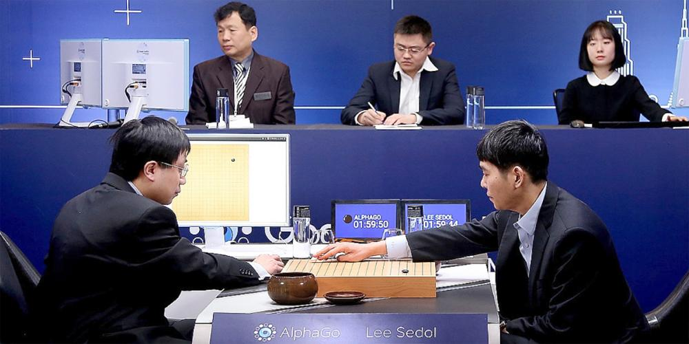
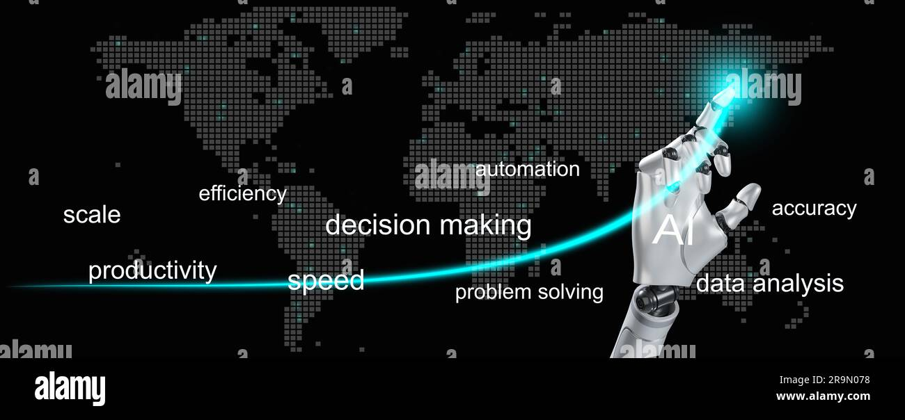

#### 引言

新的一轮技术革命浪潮席卷而来，人工智能正展现出其无比的威力和潜力。

作为围棋爱好者，我见证了 AlphaGo 从 2015 年 10 月 击败职业棋手樊麾，到 2016 年 3 月击败传奇世界冠军李世石，再到 2017 年人类棋手再也无法从 AI 手中取得一胜。专用人工智能的出现，使围棋界在两年内发生了如此天翻地覆的变化，我深感震撼。

近年来，Stable Diffusion、DALL-E 在图像生成领域炫耀了 AI 的创新力，自动驾驶技术正在改变着我们的出行方式，AI 辅助诊断和疾病预防也取得了显著成效。ChatGPT、BERT、Claude 等大型语言模型更是在构建更智能的对话系统上取得了突破性进展，成为了通用人工智能的雏形。

### 踏入变革的浪潮：人工智能如何改变我们的世界

我深信，未来的 5-10 年中，深度学习、自然语言处理和计算机视觉等技术将深刻改变我们的工作和生活方式。

在诸如 OpenAI's Codex 这样的模型的帮助下，编程已经变得更加智能化，而在医疗领域，AI 已经能够帮助我们对复杂的生物信息进行解读，为疾病诊断提供了新的方向。

同时，AI 在教育领域也发挥了重要作用，通过个性化学习，提高了学生的学习效率。在娱乐领域，AI 创造的音乐、画作和诗歌已经无法与人类创作的作品区分开。

然而，随着这些技术的进步，我们也将面临前所未有的挑战。

 **如何保护 AI 模型不受攻击，如何在保护人们隐私的同时训练出高效的 AI，如何让 AI 符合人类伦理，如何帮助因 AI 替代而可能面临失业问题的人们，都成为亟待解决的问题。**

### 踏上新征程：专注于人工智能安全

见证了 AI 的快速发展和广阔前景，我深感责任重大，未来我将选择人工智能安全这一领域作为我的科研方向。

 **我们必须在享受技术进步带来的便利的同时，防止这些技术的滥用。**

 **我们需要构建适应新时代的安全框架，以维护社会和谐，保护我们大家的利益。**

**我将致力于研究和提出解决上述问题的方案，并通过这个博客分享我的观点和成果。**

### 这个博客的使命：传递知识，携手进步

通过这个博客，我希望能分享我对人工智能安全的思考，帮助你我理解和认识人工智能的安全性。

我期待我的文章能让你我了解到人工智能安全领域的基本概念、最新进展，激发对此领域的兴趣，为人类与 AI 的和谐共存做出贡献。

这个博客也将是一个交流的平台，你我可以在这里交流思想，分享经验。

每一篇文章都是精心编排而成，我会利用我在人工智能安全方面的知识，结合 AI 为我提供的帮助，为你提供高质量的内容。

### 向前看：共同面对人工智能带来的未来

人工智能的崛起让我们有机会塑造一个前所未有的未来，一个机器不再仅仅是工具，而是我们的协作者、助手，甚至是朋友。

我们需要在享受 AI 带来的便利的同时，积极面对并解决可能带来的问题。这是一个需要我们共同面对的任务，不仅仅是科学家和研究者，而是每一个 AI 用户。

我期待与你一起在人工智能安全这个领域学习，一起探索，一起进步。让我们共同期待、创造未来。

