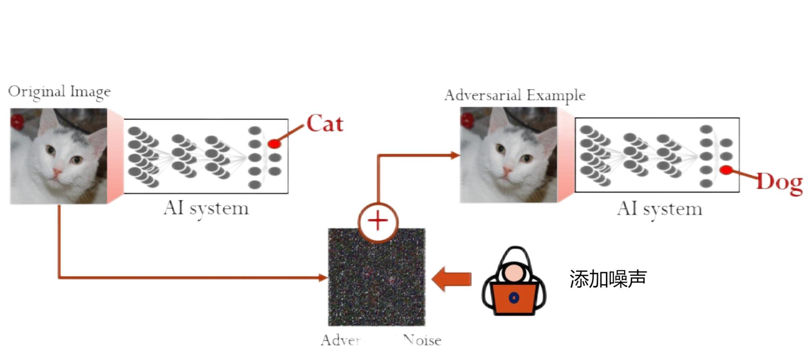
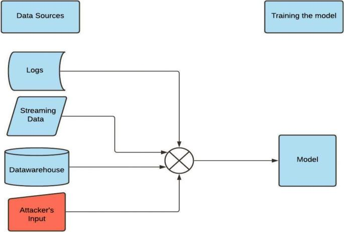
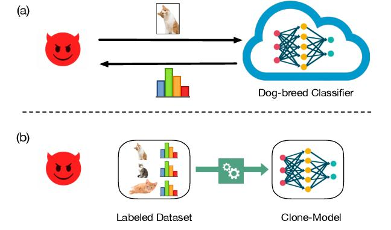
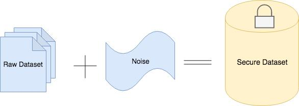
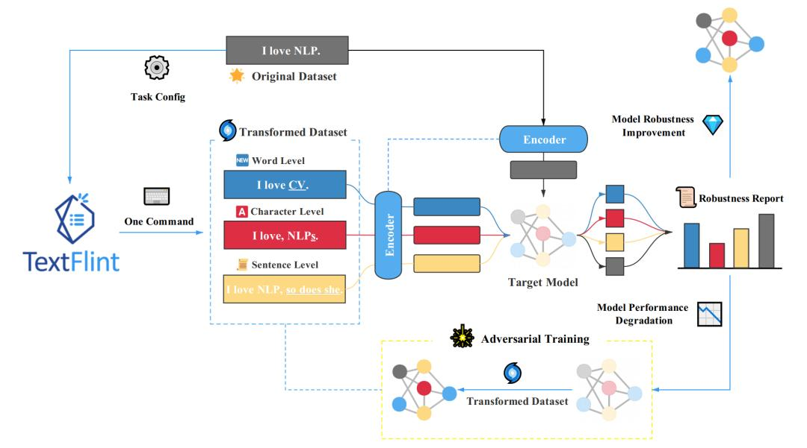

#### 引言

随着人工智能 (AI) 的发展，AI 安全成为了一个重要的研究领域。AI系统不仅要具备高精度和强大的功能，同时也必须能够抵御各种形式的攻击和保护用户隐私。在本文中，我们将详细探讨几种AI安全面临的主要挑战，并介绍对抗这些问题的一些基本策略。

### 对抗样本攻击

**对抗样本攻击**是指利用机器学习模型的漏洞，制造一些经过精心设计的输入样本，使得模型做出错误的预测。这些样本看起来与正常样本无异，却能够误导模型，从而造成安全问题。

例如，我们有一个图像分类模型，能够准确识别图像中的对象。然而，攻击者可以创建一个对抗样本来欺骗这个模型。这个对抗样本可能是一张看起来仍然像猫的图片，添加了精心设计的、几乎肉眼无法察觉的噪声，能够使图像分类模型将图片中的对象错误地分类为狗。在一些关键的应用中，例如自动驾驶汽车的图像识别系统，这样的攻击可能产生严重的后果。如果一个交通标志被对抗样本修改，可能导致自动驾驶汽车误解这个标志，从而做出危险的决定。

  
  
对抗样本攻击使猫的图片被识别成狗

为了抵抗对抗样本攻击，我们可以改进模型的训练方法，其中一种思路是使用**对抗训练**来增强模型的抗攻击性。在对抗训练中，模型被训练来识别这些对抗样本，并进行适当的分类。这样，模型就能学会抵抗对抗样本的影响，提高其在对抗攻击下的性能。例如，我们可以使用已知的对抗攻击方法生成对抗样本，并将它们加入到训练数据集中。然后，我们对模型进行训练，使其不仅能够正确地分类原始的非对抗样本，而且也能正确地分类这些对抗样本。这种方法能够使模型在面对未来可能遇到的对抗样本时，具有更好的分类性能。

### 数据投毒

**数据投毒**是指攻击者通过操纵训练数据来破坏机器学习模型的过程。攻击者在训练数据集中插入精心设计的恶意样本，使得机器学习模型在训练过程中被误导，导致模型的性能下降或产生预期外的行为。

  
  
攻击者注入训练数据

假设我们设计了一个电子邮件过滤系统，该系统基于机器学习技术识别垃圾邮件。攻击者可以通过插入设计独特的电子邮件到训练数据集中来进行数据投毒攻击。在采用这些电子邮件进行训练之后，模型就会表现出识别异常或者不稳定的行为，导致效果不佳且易于受到攻击。

为了抵御数据投毒攻击，我们可以采用**数据清洗**或**鲁棒训练**等方法。数据清洗旨在在训练阶段检测并移除恶意样本，而鲁棒训练则尝试让模型在面对恶意样本时仍能保持良好的性能。例如，我们可以开发算法去识别那些可能会改变模型决策边界的潜在恶意样本，将它们从训练数据中剔除。也可以尝试让模型在训练时对数据的微小变化保持不变，使模型在面对投毒数据时仍然能做出正确的预测。当然，这也仍需要进一步的研究，是目前机器学习安全领域的一个重要挑战。

### 模型窃取

**模型窃取**是指攻击者试图复制或模仿受保护的机器学习模型，包括其预测功能和内部信息。攻击者通常不直接访问模型的内部结构或参数，而是通过提供输入并观察输出来理解和复制模型的行为。

例如，面对一个语音识别模型，攻击者可以通过发送大量的语音样本并收集对应的文本输出，并依赖这些输入输出，逐渐模仿和复制这个语音识别模型的功能。在无需直接访问原始模型的内部结构或参数的情况下，新模型的预测性能上也可以接近原始模型。

  
  
模型窃取攻击使得攻击者能够复制受保护的机器学习模型

当然，面对模型窃取，也有一些可采取的措施。我们可以通过限制模型的访问频率，添加噪声到模型的输出，或者使用一种被称为**模型硬化**的技术来降低模型被窃取的风险。模型硬化包括将模型训练得更加复杂，使得即使攻击者获得了一些输出，也很难准确地复制模型的行为。然而，这会或多或少影响模型的性能，所以需要在保护模型与保持性能之间找到一个平衡。

### 用户隐私保护

随着数据驱动型应用的兴起，用户隐私和数据泄露问题变得愈发重要。AI模型在训练时需要大量的数据，如果不采取有效的安全措施，可能会导致用户数据的泄露。

例如，当我们使用含有用户敏感信息的数据集进行模型训练时，这些信息可能会被模型无意中 “**记住**” 并在之后的推理预测中暴露出来，这被称为 “**模型过拟合**”。另一种情况下，攻击者可以通过 “**模型逆向工程**” 或 “**模型窥视攻击**” 来恢复原始训练数据，也会造成数据泄露。

为了解决这个问题，我们可以使用加密技术，例如**差分隐私**和**同态加密**，这些技术能够有效去除训练数据中的敏感成分，来保护数据的隐私和安全。

  
  
差分隐私示意图

### 模型的健壮性

**健壮性**是指模型在面对新的、未见过的数据时，仍能做出正确的预测。如果模型的健壮性不足，可能会被恶意攻击者利用，导致安全问题。

例如，我们有一个 AI 模型，其任务是进行信用卡欺诈检测，模型已经被训练好，并在历史数据上表现优秀。然而，恶意攻击者可能会执行一系列正常的小额交易，提升模型对它的信任度，然后在合适的时机执行大额的欺诈性交易。如果模型的健壮性不足，没法处理这种在训练数据中未见过的欺诈性交易模式，那么这种欺诈策略就可能奏效。

模型的健壮性问题并不仅限于类似的高风险的应用场景，任何的AI模型都可能会遇到新的、未知的输入数据，如果模型对这些未知的数据反应不足，都可能会导致预测的结果不准确。

为了增强模型的健壮性，我们可以使用解释性强的模型，同时对模型进行压力测试，确保模型在各种情况下都能稳定运行。压力测试可能包括使用一些极端情况的数据对模型进行测试，或者对模型输入添加噪声，看模型的预测结果是否会因此发生显著变化。通过这些方式，我们可以更好地理解模型的行为，并提升模型对未知数据的健壮性。

  
  
复旦大学自然语言处理健壮性检测平台 TextFlint

#### 总结

在文章中，我们讨论了对抗样本攻击、数据投毒、模型窃取、用户隐私保护和模型的健壮性等多个主题。值得注意的是，这些攻击方法有可能会被联合使用，例如，通过模型窃取来寻找对抗样本攻击的输入样本。因此，防范时要倍加小心，不能只关注单一的安全挑战。我们也了解了一些防范策略，但这仅仅是冰山一角，还有很多AI安全的挑战和方向值得我们进一步探索。希望本文能为大家提供一些思路，并欢迎大家一起交流和探讨，共同推动AI安全领域的发展。