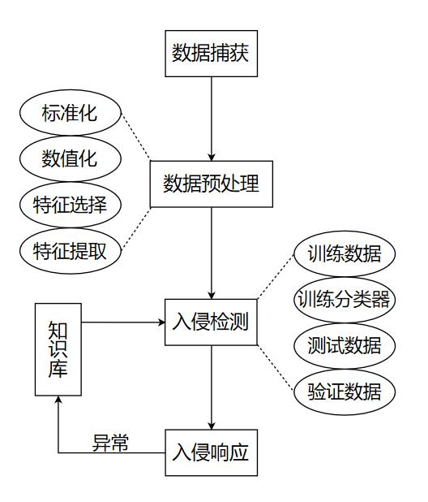
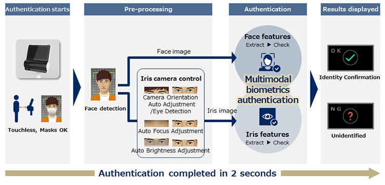
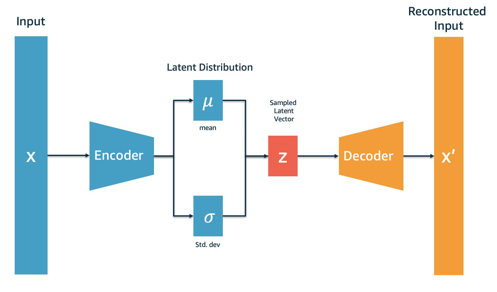
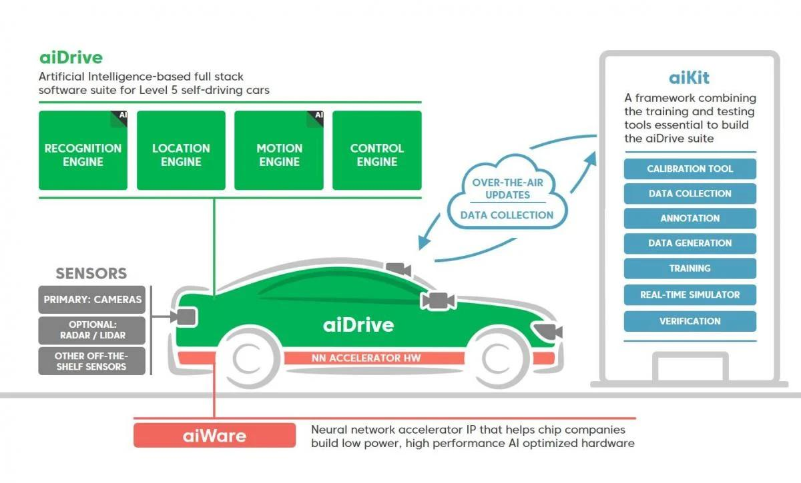

#### 引言

人工智能（AI）在安全领域的应用及其广泛，从网络安全到生物识别，再到欺诈检测与自动驾驶，AI 不仅正在改变现有的游戏规则，同时也给我们带来新的可能性和风险。在这篇博文中，我将带您深入探讨 AI 在这些领域的具体应用和影响，以期对 AI 的全貌有更深入的理解。

### 网络空间安全

网络安全是人工智能的一项重要应用。网络安全防护的传统方法通常需要大量人工干预，依赖已有的规则和模式，在对付海量数据流和新兴攻击手段时，往往显得力不从心。而AI在训练后能自动分析数据，有效地探测出隐秘的网络威胁。

以网络入侵检测和预防系统为例，传统方法主要包括**基于签名的检测**和**基于异常的检测**。基于签名的检测依赖于已知的攻击模式（即签名）的数据库，一旦检测到的活动与数据库中的某个签名相符，便会触发警报。然而，这种方法在应对未知攻击模式时的效率往往不高。而基于异常的检测，是通过定义网络中的“正常”行为，一旦检测到的行为与正常行为显著偏离，系统就会触发警报。这种方法很容易引发误报，导致不必要的损失。

AI 和机器学习的应用改变了这个领域的游戏规则。它们可以进行大规模的深度数据分析，揭示潜在的威胁和恶意行为。AI 在入侵检测和预防中的主要应用方式包括：

1. **异常检测**：通过学习网络中正常的行为模式，改进基于异常的检测。例如，深度学习算法能理解复杂的行为模式和关联，从而更准确地确定哪些是正常行为，哪些是异常行为。这样，AI 系统可以在降低误报率的同时，更有效地识别真正的威胁。

2. **预测性分析**：利用历史数据预测未来可能出现的威胁。例如，如果某个系统在过去经常受到攻击，AI 可以预测这个系统在未来可能再次成为攻击目标。

3. **自我适应**：AI系统可以根据新的威胁和攻击模式进行自我调整和学习。相比传统的基于签名的系统，可以在处理新的和未知的威胁时可以更快地做出反应。

4. **自动化响应**：一旦检测到威胁，AI 可以自动执行一系列的响应措施，比如隔离受影响的系统，阻止恶意流量，或者通知安全团队。

  
  <a style="color: gray; font-weight: bold;" href="https://www.cnblogs.com/Weber-security/p/12622254.html">汽车通信总线网络入侵检测方法示意图</a>
  
 

AI 在网络空间安全的其他领域，如网络流量分析、端点设备的安全防护、恶意软件和病毒检测等方向，也发挥着重要的作用。AI 为网络安全带来了重大变革，它提供了一种动态、适应性强、自动化程度高的方法来防御网络威胁，为现代网络生态保驾护航。

### 生物识别

在生物识别（Biometrics）领域，AI 也已经产生了广泛影响，正在改变身份验证的方式。深入讨论之前，我们先来了解一下什么是生物识别。

**生物识别**是一种身份验证技术，它依赖于个体的生物特性或行为特性。这些特性可以包括**指纹、面部特征、声音、虹膜、甚至行走方式**等。生物识别系统能够捕捉、存储并分析这些特征，进而用于身份验证。

在人工智能出现之前，生物识别系统大多依赖传统技术，比如指纹识别，该技术依赖于图像处理，将指纹的独特纹理转化为可识别的数据。或者声纹识别，通过对声音的频率、音调和节奏等进行分析来识别个体。虽然这些系统已经能够完成一些特定任务，但它们的准确性和效率都难以继续提升。

随着深度学习的兴起，生物识别领域的身份验证方式正在发生变革。现代面部识别技术能通过神经网络进行深度学习，能捕捉并分析面部更多的细节和特征，如面部形状、纹理、色彩、甚至是动态特征，从而大幅度提升了识别的准确性。

在声纹识别领域，AI 技术也取得了显著的突破。训练有素的深度学习模型可以更精确地理解和学习人类的声音特性，包括音调、语速、音色等，并以此进行更为精确的身份验证。

  
  <a style="color: gray; font-weight: bold;" href="https://www.nec.com/en/press/202005/global_20200514_01.html">NEC 公司提出的多模态生物识别系统</a>
  
 

此外，AI 还在许多新的生物识别领域中产生了深远的影响，例如行为生物识别，这种技术可以通过分析个体的行走方式、打字习惯、手机使用方式等行为特征进行身份验证。

### 欺诈检测

欺诈检测在许多领域都有其重要性，特别是在金融、电子商务和保险行业等。在人工智能的助力下，欺诈检测的效率和准确性都得到了显著的提升。

传统的欺诈检测方式通常依赖于规则引擎或统计模型。规则引擎根据特定的业务规则进行欺诈检测，例如，如果一个账户在短时间内有大量的交易活动，或者交易地点在两个城市间迅速变换，这些都可能被标记为欺诈行为。而统计模型则通过统计分析的方式来发现异常行为，比如使用逻辑回归、决策树等算法。

然而，这些传统的欺诈检测方法有其局限性。规则引擎依赖于人工设定的规则，可能难以应对复杂和新型的欺诈手段。而统计模型可能需要大量的手动特征工程，且可能无法充分检测出一些非线性和复杂的欺诈行为。

深度学习技术的兴起为欺诈检测提供了新的可能性。例如，使用**深度神经网络**，我们可以自动从原始数据中学习到特征，而无需进行手动的特征工程。这使得深度学习模型能够捕捉到更复杂的欺诈行为模式。此外，**自编码器**，一种深度学习模型，也广泛应用于欺诈检测。自编码器能够学习输入数据的高维特征，并试图重构输入数据。在欺诈检测中，正常行为的数据用于训练自编码器，然后使用训练好的模型来重构新的数据。如果重构误差超出了某个阈值，那么这个新数据就可能被认为是异常的，也就是可能的欺诈行为。

  
  <a style="color: gray; font-weight: bold;" href="https://aws.amazon.com/blogs/machine-learning/deploying-variational-autoencoders-for-anomaly-detection-with-tensorflow-serving-on-amazon-sagemaker/">亚马逊提出的自编码器异常检测工作流程</a>
  
 

总的来说，深度学习在欺诈检测领域的应用带来了显著的改善。然而，我们也需要注意，深度学习模型可能更为复杂，需要更多的数据和计算资源，并且可能更难以解释。因此，在实际应用中，可能需要将深度学习与其他方法结合使用，以实现最佳的欺诈检测效果。

### 自动驾驶

当前，自动驾驶技术的发展很大程度上依托于人工智能技术。尤其在提升自动驾驶的安全性方面，AI的应用主要体现在以下几个关键领域：

1. **环境感知**： 自动驾驶系统需要对周围环境有准确的感知，包括其他车辆、行人、自行车、道路标志、交通信号等。AI 技术，特别是计算机视觉和深度学习，被广泛用于图像和视频数据的处理中，以便提取出有用的信息。

2. **预测和决策**： 自动驾驶系统需要预测其他道路使用者的行为，如前方车辆的转向或变速，行人是否会穿过马路等。此外，系统还需要做出决策，如何调整车辆的速度和方向，何时刹车或转向等。这些预测和决策任务极其复杂，而强化学习等技术，正在被用来处理这些任务。

3. **驾驶行为学习**： AI 能从大量驾驶数据中学习并理解人类驾驶员的行为和决策模式，这有助于自动驾驶系统更好地模拟人类驾驶员的行为，从而提高驾驶的平滑性和安全性。

4. **系统监控和维护**： AI 可用于监控自动驾驶系统的运行状态，预测和检测可能的故障。例如，通过分析车辆的传感器数据，AI可以预见某些部件可能出现的故障，从而提前进行维护，防止在行驶过程中出现故障。

  
  <a style="color: gray; font-weight: bold;" href="https://www.fierceelectronics.com/components/artificial-intelligence-autonomous-driving">自动驾驶生态系统</a>
  
 

尽管AI在提升自动驾驶安全性方面具有巨大的潜力，但同时也存在一些挑战。例如，AI模型的解释性通常较弱，可能产生一些难以理解的决策。此外，AI 模型的性能可能会受到训练数据质量的影响，如果训练数据存在偏差或噪声，可能会降低模型的性能。另外，AI 系统可能会受到恶意攻击，如对输入数据的篡改或欺骗。因此，如果要在自动驾驶系统中使用 AI 并达到近乎 100% 的可靠性，还需要进行更深入的研究。

#### 总结

在此，我们探讨了人工智能在各种安全相关领域的应用，包括网络空间安全、生物识别、欺诈检测以及自动驾驶技术。无疑，AI 已经成为推动这些领域发展的重要驱动力，能够提供更高效、更准确的解决方案。然而，正如我们所看到的，AI 带来的优势的同时，也带来了新的挑战和风险。它可能自身成为攻击的目标，或被用来发起攻击。因此，我们必须在享受 AI 带来的好处的同时，始终保持警惕，采取恰当的安全措施，以确保我们能在这个快速变化的领域中保持安全并最大化利用 AI 的潜力。在未来，我们期待通过进一步的研究和探讨，找到平衡 AI 创新与安全之间的最佳方式。